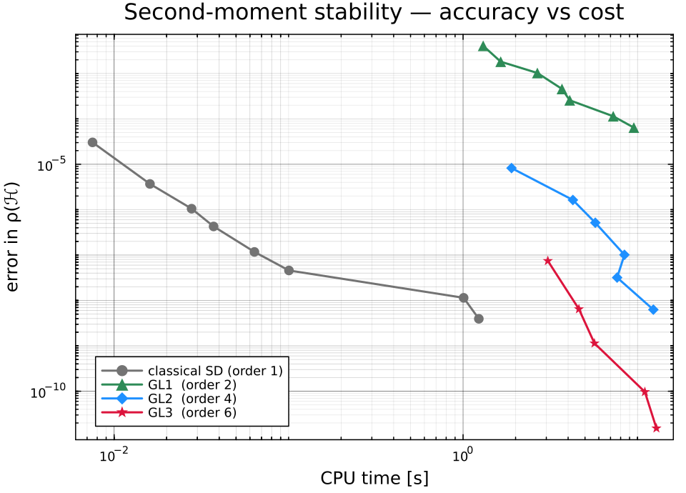
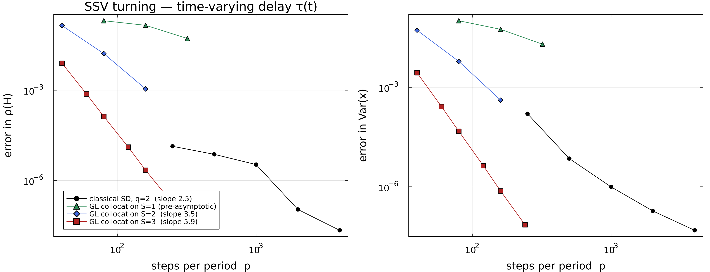
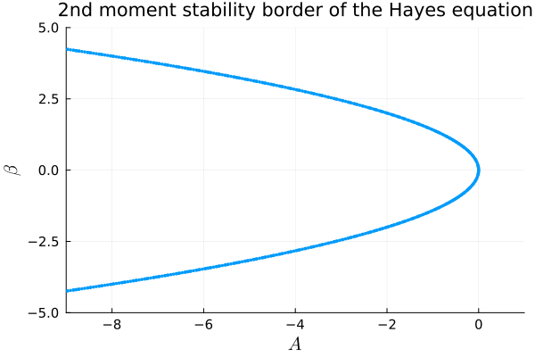
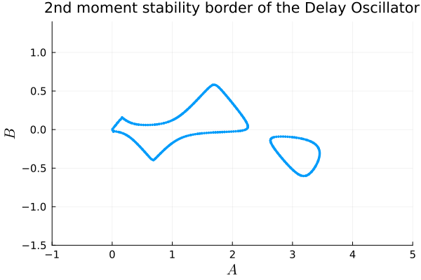

# StochasticSemiDiscretizationMethod.jl

[](https://bachrathyd.github.io/StochasticSemiDiscretizationMethod.jl/stable)
[](https://bachrathyd.github.io/StochasticSemiDiscretizationMethod.jl/dev)
[](https://github.com/bachrathyd/StochasticSemiDiscretizationMethod.jl/actions/workflows/CI.yml)
[](https://codecov.io/gh/bachrathyd/StochasticSemiDiscretizationMethod.jl)

Efficient moment-stability and stationary-behaviour analysis of linear stochastic
delay differential equations.

> **Note — the name is historical.** This package began as the *classical*
> semi-discretization method, but it has grown well beyond it. It now provides an
> `O(p²)` **multiplication-free** evaluation of the second-moment operator, a
> **Kronecker-factored** form for high state dimension, an optional **CUDA GPU**
> backend, and — the current flagship — a **high-order Gauss–Legendre collocation**
> solver that reaches **order 2S** in the second moment (e.g. order 6 at `S=3`)
> with far smaller memory use per digit of accuracy. We keep the registered name
> for continuity, but "semi-discretization" is now just one of several methods
> inside it.

Rule of thumb: the classical/factored path is best for **high state dimension**
and engineering tolerances; the **collocation** path (`spectralRadiusOfMapping_collocation`,
default `S=3` ≈ GL3) wins decisively at **tight tolerances** in low/moderate
dimension. See the
[documentation](https://bachrathyd.github.io/StochasticSemiDiscretizationMethod.jl/stable)
for the full API and worked examples, and [`CITATION.bib`](CITATION.bib) to cite the method.

## High-order convergence

The unified interface picks the discretization by keyword — Gauss–Legendre
collocation (order `2S`) by default:

```julia
using StochasticSemiDiscretizationMethod, StaticArrays
# ... build prob::LDDEProblem, principal period T, steps-per-period p ...
ρ   = spectralRadiusOfMoment(prob, T, p; method = GaussLegendre(3))  # order 6 (default)
var = stationaryVariance(prob, T, p;    method = GaussLegendre(3))
ρsd = spectralRadiusOfMoment(prob, T, p; method = ClassicalSD(2))     # classical, for reference
```

Accuracy (error in ρ(𝓗)) vs CPU time on a **critical** delayed Mathieu oscillator
— high natural frequency (ωn = 5), so the delay spans ~5 oscillations and many
discretization points are genuinely needed. Collocation orders GL1–GL5 (order
2–10) are shown from `p = 1`, so the full convergence onset is visible; timing is
measured with BenchmarkTools (reproduce with
[`examples/plot_highorder_wp.jl`](examples/plot_highorder_wp.jl)):



Both backends are performance-tuned. The collocation engine precomputes the
per-step noise block (a fixed linear operator that a naive implementation
rebuilds on every Krylov iteration) and applies the one-period covariance map on
an allocation-free block ring buffer; the classical multiplication-free /
Kronecker-factored kernel dispatches to an inlined StaticArrays fast path for
small state dimension (`d ≤ 8`), removing the per-block `mul!` call overhead that
dominates at `d = 2` — so the whole diagram fits in milliseconds-to-≈1 s. The
**slope of each curve is its order** (2, 4, 6, 8, 10): the higher the order, the
faster the error falls per unit CPU, and the high orders (GL3–GL5) dive below
every other method once the tolerance tightens. Note the honest nuance — with
`ClassicalSD(2)` the classical scheme is genuinely ~2nd-order on this
light-noise problem, so it stays competitive through the mid-range and only
GL4/GL5 clearly dominate at tight tolerance (a problem with delayed
*multiplicative* noise, β ≢ 0, would push the classical scheme back to first
order, but that engages the slower non-pruned collocation path). For high state
dimension (the collocation engine is limited to low/moderate `d`, a single delay
and a single Wiener channel) the factored classical path is the only one that
scales.

### Automatic path selection — you never choose

The engine reads the *structure* of your problem and always takes the fastest
correct path; **there is nothing to configure**. The only choice that is yours is
the accuracy target (the `method` keyword, e.g. `GaussLegendre(3)` for order 6
vs `ClassicalSD(2)`) — everything below it is automatic and the answer is the
same regardless:

- **No delayed multiplicative noise (`β ≡ 0`)** — feedback control (P or PD),
  regenerative machining with noise on the *present* cutting force, or any model
  whose stochastic terms read only the present state. The collocation engine
  detects this from the coefficients and **prunes** the covariance block from
  `2S+2` to `S+2` sub-states: **≈2.6–2.8× less memory and ≈1.4× faster per
  solve**. This is exactly the case in the figure above (a lightly-damped delayed
  Mathieu), which is why GL5 reaches the solver floor within a few milliseconds.
- **Delayed multiplicative noise (`β ≢ 0`)** — e.g. milling with force-coefficient
  noise that also reads the *delayed* tool position. The full, unpruned block is
  used automatically, at no overhead.

The detection is a structural test of the coefficient functions — you pass your
`LDDEProblem` and the best internal path runs. The result is **bit-identical**
either way (verified to `10⁻¹³` on both `ρ(𝓗)` and the stationary variance): the
pruning changes only the cost, never the number. On top of that, every path here
is orders of magnitude cheaper than the classical explicit period product — the
multiplication-free evaluation alone is ≈`8.5×10³` faster at `p = 192` (see the
[paper](paper/)'s work-precision study).

> **Timing tip.** These solvers do many small/thin matrix products, and default
> multithreaded BLAS forks all its threads for each one — the fork/join overhead
> then dominates, causing a sudden jump in CPU time at a resolution threshold
> (and a large fixed floor at small step counts). Pin BLAS to one thread with
> `using LinearAlgebra; BLAS.set_num_threads(1)` — it is both smoother and much
> faster here. For stability-chart sweeps, keep BLAS single-threaded and
> parallelise the outer parameter loop with Julia threads instead.

## What order to expect — delay type × feedback structure

Since v1.1 the collocation interface also handles **time-varying delays**. The
problem class is detected automatically from how you *define* the system (no
switches); whenever the attainable order is below the `2S` that
`Collocation(S)`/`GaussLegendre(S)` advertises, one warning explains what was
used and why (silence with `verbosity=0`). The expected second-moment
convergence order:

| Delay | Delayed read ("feedback") | Engine used | Expected order |
|---|---|---|---|
| constant, **grid-aligned** (`τ = r·Δt`) | smooth (position) **or** rough (velocity) | aligned integrated-history (`β≡0`: pruned) | **2S** |
| constant, **misaligned** (`τ ≠ r·Δt`) | smooth or rough | fractional-limit integrated-history | **[S+1, 2S]** ⚠ |
| **time-periodic smooth `τ(t)`** (`τ(t) ≥ Δt`) | smooth or rough | fractional-limit integrated-history | **floor S+1**, measured ≈ 2S ⚠ |
| varying `τ(t)` **with delayed multiplicative noise** (`β ≢ 0`), or multiple delays / Wiener channels | — | classical MF-factored fallback | **1** ⚠ |
| `ClassicalSD(q)` (any delay) | smooth or rough | classical MF-factored | **1** (any `q`) |

⚠ = one explanatory warning (suppress with `verbosity=0`).

Two structural points worth internalizing:

- **Rough vs smooth reads do not change the order here.** A "rough" read means
  the delayed term touches a state component that is directly Wiener-driven
  (e.g. delayed *velocity* feedback — the D part of a PD controller). Point-sampling
  schemes collapse to ~order 2 on rough reads; the integrated-history blocks of
  this package evaluate the delayed drift *exactly* from pre-integrated DOFs, so
  rough and smooth reads converge at the same rate — also with the time-varying
  delay engine.
- **Measured, not just promised.** On the spindle-speed-variation (SSV) turning
  model (sinusoidal `τ(t)`, delay spanning ≈5–8 steps), the measured orders are
  **3.5 at `S=2`** and **5.9 at `S=3`** — at or near the superconvergent `2S`,
  well above the guaranteed `S+1` floor. (Reference: Richardson extrapolation of
  the finest ladder, cross-validated against the independently extrapolated
  classical path to `8×10⁻⁸` relative; reproduce with
  [`benchmark/ssv_timevarying_orders.jl`](benchmark/ssv_timevarying_orders.jl)):



  `S=3` at `p ≈ 160` already matches what the classical scheme needs
  `p ≈ 4000` for. (On this additive-noise-only problem the classical scheme
  rides its *deterministic* order ≈2 — its generic first-order stochastic cap
  does not bind here, so the comparison above is a conservative one.)

The mini-demos below share this prelude (a 1-DOF oscillator, `d = 2`,
`x = [position; velocity]`, additive noise on the velocity):

```julia
using StochasticSemiDiscretizationMethod, StaticArrays
A(t)  = @SMatrix [0.0 1.0; -(1.0+0.5cos(2π*t)) -0.4]   # smooth, T-periodic drift
α(t)  = @SMatrix [0.0 0.0; 0.25 0.0]                    # multiplicative noise (present state)
z2    = @SMatrix zeros(2, 2)
σ     = @SVector [0.0, 0.3]                             # additive noise → velocity row
T = 1.0; p = 16                                         # period, steps per period
mkprob(τ, B; β = t -> z2) =
    LDDEProblem(ProportionalMX(A), [DelayMX(τ, B)],
                [stCoeffMX(1, ProportionalMX(α))], [stCoeffMX(1, DelayMX(τ, β))],
                Additive(2), [stAdditive(1, Additive(σ))])
```

### Constant aligned delay, smooth read — order 2S

Delayed **position** feedback; `τ = 0.5 = 8·Δt` is an integer number of steps:

```julia
B(t) = @SMatrix [0.0 0.0; 0.2 0.0]                 # reads x₁ (position): smooth
prob = mkprob(0.5, B)                               # τ passed as a NUMBER
ρ    = spectralRadiusOfMoment(prob, T, p)           # aligned engine, order 6 (S=3)
```

### Constant aligned delay, rough read — still order 2S

Delayed **velocity** feedback (the delayed-D term of a PD controller). The
velocity is Wiener-driven ("rough"), but the integrated-history blocks keep the
full order:

```julia
Bpd(t) = @SMatrix [0.0 0.0; 0.2 0.12]              # reads x₁ AND x₂ (velocity): rough
ρ = spectralRadiusOfMoment(mkprob(0.5, Bpd), T, p)  # order 2S regardless
```

### Constant misaligned delay — order in [S+1, 2S]

If `τ` is not an integer multiple of `Δt = T/p`, the fractional-limit engine
runs and a warning suggests the aligning `n_steps` (often the better fix):

```julia
ρ = spectralRadiusOfMoment(mkprob(0.618, B), T, p)          # warns: misaligned
ρ = spectralRadiusOfMoment(mkprob(0.618, B), T, p; verbosity = 0)  # silent
```

### Time-periodic (smooth) delay — floor S+1, measured ≈ 2S

Pass the delay as a **function** — that is the entire difference. Requirements:
`τ(t) ≥ Δt` (an error reports the minimum `n_steps`), `τ` T-periodic and smooth,
and `ξ(t) = t − τ(t)` increasing — a **one-sided** bound `τ′(t) ≤ 0.9`; the
delay may *decrease* arbitrarily fast:

```julia
τfun(t) = 0.45 + 0.08sin(2π*t)                     # smooth, T-periodic, ≥ Δt
ρ   = spectralRadiusOfMoment(mkprob(τfun, B), T, p)
var = stationaryVariance(mkprob(τfun, B), T, p)
```

(For real spindle-speed variation the same pattern reads
`τ(t) = (2π/z)/Ω(t)` with `Ω(t) = Ω₀(1 + RVA·sin(2π t/T))` and `T` the
modulation period.) Rough reads (`Bpd` above) work identically — same order.

### Delayed multiplicative noise (β ≢ 0)

With a **constant aligned** delay, delayed multiplicative noise is fully
supported (the engine simply keeps the unpruned block — automatic):

```julia
βn(t) = @SMatrix [0.0 0.0; 0.1 0.0]                # noise reads the DELAYED state
ρ = spectralRadiusOfMoment(mkprob(0.5, B; β = βn), T, p)   # order 2S, unpruned
```

With a **varying** delay this combination is outside the collocation scope: the
unified interface falls back to the classical factored path (order 1) with a
warning, and the direct `*_collocation` wrappers raise an error instead.

### Non-smooth coefficients CAN cap the order — for every method

The orders above assume the **coefficients** `A(t), B(t), α(t), σ(t)` are smooth.
If a coefficient is only `C⁰` (continuous with derivative kinks — e.g. the
trapezoidal engagement of a *helical* milling cutter) the attainable order caps
at ≈ **2**; `C¹` coefficients cap at ≈ **3**; genuine jumps (straight-fluted
milling entry/exit) cap at ≈ **1** — *for every discretization, regardless of
`S` or `q`*. This is a property of the model, not the method. Practical notes:

- If the kink locations are **fixed in time** (constant spindle speed), choose
  `n_steps` so that they fall on step boundaries — every step then sees a smooth
  coefficient and the full order returns.
- Under SSV the kink times drift, so no uniform mesh aligns with them; expect
  the ≈2 cap in the asymptotic regime, though the *pre-asymptotic* accuracy at
  engineering tolerances usually still favours the high-order engine (the kink
  error carries a small constant).
- A smoothed coefficient model (e.g. a truncated-Fourier milling force) restores
  the full order of the smooth-model solution — the modelling error is then a
  separate, controllable question.


[1] [Stochastic semi‐discretization for linear stochastic delay differential equations](https://onlinelibrary.wiley.com/doi/abs/10.1002/nme.6076) and the book
[2] [Semi-Discretization for Time-Delay Systems (by Insperger and Stepan)](http://link.springer.com/10.1007/978-1-4614-0335-7).

This package provides a tool to approximate the stability properties and stationary behaviour of linear periodic delay systems of the forms:

<!-- $$\mathrm{d} \mathbf{x}(t) = \left(\mathbf{A} \mathbf{x}(t) + \sum_{j=1}^g \mathbf{B}_j \mathbf{x}(t-\tau_j)+\mathbf{c}\right)\mathrm{d}t + 
        \sum_{k=1}^w\left(\boldsymbol{\alpha}^k +  \sum_{j=1}^g \boldsymbol{\beta}^k_j \mathbf{x}(t-\tau_j) + \boldsymbol{\sigma}^k \right)\mathrm{d}W^k(t)$$ -->

$$\mathrm{d} \mathbf{x}(t) = \left(\mathbf{A}(t) \mathbf{x}(t) + \sum_{j=1}^g \mathbf{B}(t) \mathbf{x}(t-\tau_j(t))+\mathbf{c}(t)\right)\mathrm{d}t + 
        \sum_{k=1}^w\left(\boldsymbol{\alpha}^k(t) +  \sum_{j=1}^g \boldsymbol{\beta}^k_j(t) \mathbf{x}(t-\tau_j(t)) + \boldsymbol{\sigma}^k(t) \right)\mathrm{d}W^k(t)$$

by transforming the underlying differential equation into the stochastic mapping:

$$\mathbf{y}_{n+1} = \left(\mathbf{F}_n+\sum_{k=1}^w\mathbf{G}^k_n\right)\mathbf{y}_n + \left(\mathbf{f}_n + \sum_{k=1}^w\mathbf{g}^k_n\right),$$

where $n$ refers to the discrete time $t_n = n \Delta t$, $\mathbf{F}_n$ is the deterministic mapping matrix constructed using $\mathbf{A}$, $\mathbf{B}$ and $\tau_j$, $\mathbf{G}^k_n$ are the stochastic mapping matrices constructed using $\boldsymbol{\alpha}(t)$, $\boldsymbol{\beta}(t)$ and $\tau_j$, $\mathbf{f}_n$ and $\mathbf{g}^k_n$ are the deterministic and stochastic additive vectors, constructed using $\mathbf{c}$ and $\mathbf{\sigma}^k$, respectively.
The vector $\mathbf{y}_n$ is the discretized state space vector:

$$\mathbf y_{n} = \left(\mathbf{x}(t_n)^\top, \mathbf{x}(t_{n-1})^\top,\ldots,\mathbf{x}(t_{n-r})\right)^\top\!.$$

The first moment dynamics is described by the expected value of the stochastic mapping, leading to a deterministic mapping:

$$\mathbb{E}\left(\mathbf{y}_{n+1}\right) = \mathbf{F}_n\left(\mathbf{y}_n\right)+\mathbf{f}_n,$$
while the second moment dynamics is described by the expected value of the outer product of the mapping:

$$\mathbf M_n = \mathbb{E}\left(\mathbf y_n \mathbf y_n^\top\right), 
\quad \Rightarrow \quad \mathbf m_n = \mathrm{vec}\left(\mathbf M_n\right) :=
\left[ M_{n,11}, M_{n,22},\dots , M_{n,12}, M_{n,23},\dots, M_{n,1,\left(r+1\right)d} \right]^\top,$$

$$\mathbf m_{n+1} =\mathbf H_n \\, \mathbf m_n + \mathbf h_{1,n}\mathbb{E}\left(\mathbf y_n\right)+\mathbf h_n,$$

where coefficient matrices $\mathbf{H}_n$, $\mathbf{h}_{1,n}$ and additive vector $\mathbf{h}_n$ are constructed using the mapping matrices $\mathbf{F}_n$, $\mathbf{G}^k_n$ and vectors $\mathbf{f}_n$, $\mathbf{g}^k_n$, respectively.
Note, that since the coefficient matrices of the original system are constant, the statistical properties of the coefficient matrices and additive vectors, hence the matrices $\mathbf{F}_n$, $\mathbf H_n$, $\mathbf{h}_{1,n}$ and vectors $\mathbf{f}_n$, $\mathbf{h}_n$ are also constant.
The integer $r$ is chosen in a way, that $r \Delta t \geq \max_{t \in \left[ 0, P \right], j = 1 \ldots g}\tau_j(t)$ (the discretized "history function" contains all possible delayed values) and $d$ is the dimension of the state space $\left(\mathbf{x}(t) \in \mathbb{R}^d\right)$..

<!-- Each coefficient matrices of delay differential equations are periodic, with a principle period of $P$ -->
<!-- <a href="https://www.codecogs.com/eqnedit.php?latex=P" target="_blank"></a>
, namely: -->
<!-- $A(t)=A(t+P),\; B_j(t)=B_j(t+P),\; \tau_j(t)=\tau_j(t+P)$) and $c(t)=c(t+P)$ -->
<!-- 
Furthermore, the integer $r$ -->
<!-- <a href="https://www.codecogs.com/eqnedit.php?latex=r" target="_blank"></a>
is chosen in a way, that $r\Delta t\geq \max_{t \in \left[0,P\right],j=1\ldots g}\tau_j(t)$ -->
<!-- <a href="https://www.codecogs.com/eqnedit.php?latex=\inline&space;r\Delta&space;t\geq&space;\max_{t&space;\in&space;\left[0,P\right],j=1\ldots&space;g}\tau_j(t)" target="_blank"></a>
 (the discretized "history function" contains all possible delayed values).   -->

With the use of the discrete mappings, the moment stability of the original system can be investigated (approximately), by the spectral radius $\rho$ of the coefficient matrices $\mathbf{F}_n$ over a period:

$$\rho\left(\prod_{i=0}^{p-1}{F}_{n+i}\right): \quad
    \begin{matrix}
    <1 & \Rightarrow & \text{the mapping is stable}\\
    >1 & \Rightarrow & \text{the mapping is unstable}
    \end{matrix}
    $$

Furthermore, the steady-state first and second moments can be determined as the fix points of corresponding moment mappings.
# Citing

If you use this package as part of your research, teaching, or other activities, we would be grateful if you could cite the paper [1] and the book it is based on (BibTeX entries):
```
@article{Sykora2019,
author = {Sykora, Henrik T and Bachrathy, Daniel and Stepan, Gabor},
doi = {10.1002/nme.6076},
journal = {International Journal for Numerical Methods in Engineering},
keywords = { stability, stochastic problems, time delay,differential equations},
number = {ja},
title = {{Stochastic semi-discretization for linear stochastic delay differential equations}},
url = {https://onlinelibrary.wiley.com/doi/abs/10.1002/nme.6076},
volume = {0}
}

@book{Insperger2011,
address = {New York, NY},
author = {Insperger, Tam{\'{a}}s and St{\'{e}}p{\'{a}}n, G{\'{a}}bor},
doi = {10.1007/978-1-4614-0335-7},
isbn = {978-1-4614-0334-0},
publisher = {Springer New York},
series = {Applied Mathematical Sciences},
title = {{Semi-Discretization for Time-Delay Systems}},
url = {http://link.springer.com/10.1007/978-1-4614-0335-7},
volume = {178},
year = {2011}
}
```

# Usage with examples
## Installation
```julia
julia> ] add StochasticSemiDiscretizationMethod
```

## Stochastic Hayes equations
$$\mathrm{d}{x}(t) = a \,x(t)\mathrm{d}t + \left(\beta \,x(t-1) + 1\right) \mathrm{d}W(t),$$
Here 

$$ \mathbf{A}(t) \equiv \begin{bmatrix} a \end{bmatrix},
\quad \mathbf{B}_1(t) \equiv \begin{bmatrix}0\end{bmatrix},
\quad \mathbf{c}(t) \equiv \begin{bmatrix} 0 \end{bmatrix},$$
$$ \boldsymbol{\alpha}^1(t) \equiv \begin{bmatrix} 0 \end{bmatrix},
\quad \boldsymbol{\beta}^1_1(t) \equiv \begin{bmatrix}\beta\end{bmatrix},
\quad \tau^1_1(t) \equiv 1 
\quad \mathrm{and} \quad \boldsymbol{\sigma}^1(t) \equiv \begin{bmatrix} 1 \end{bmatrix}.$$

(First example in paper [1])

```julia
using StochasticSemiDiscretizationMethod
```

```julia
function createHayesProblem(a,β)
    AMx =  ProportionalMX(a*ones(1,1));
    τ1=1. 
    BMx1 = DelayMX(τ1,zeros(1,1));
    cVec = Additive(1)
    noiseID = 1
    αMx1 = stCoeffMX(noiseID,ProportionalMX(zeros(1,1)))
    βMx11 = stCoeffMX(noiseID,DelayMX(τ1,β*ones(1,1)))
    σ = stAdditive(1,Additive(ones(1)))
    LDDEProblem(AMx,[BMx1],[αMx1],[βMx11],cVec,[σ])
end
```

```julia
hayes_lddep=createHayesProblem(-6.,2.); # LDDE problem for Hayes equation
method=SemiDiscretization(0,0.1) # 0th order semi discretization with Δt=0.1
τmax=1. # the largest τ of the system
# Second Moment mapping
mapping=DiscreteMapping_M2(hayes_lddep,method,τmax,n_steps=10,calculate_additive=true); #The discrete mapping of the system
```

```julia
@show spectralRadiusOfMapping(mapping); # spectral radius ρ of the mapping matrix (ρ>1 unstable, ρ<1 stable)
statM2=VecToCovMx(fixPointOfMapping(mapping), length(mapping.M1_Vs[1])); # stationary second moment matrix of the hayes equation (equilibrium position)
@show statM2[1,1]

# spectralRadiusOfMapping(mapping) = 0.3835887415448961
# statM2[1,1] = 0.12505625506304247
```

### Stability borders of the Hayes Equation
```julia
using MDBM
using Plots
gr();
using LaTeXStrings
```

```julia
method=SemiDiscretization(0,0.1);
τmax=1.

foo(a,b) = log(spectralRadiusOfMapping(DiscreteMapping_M2(createHayesProblem(a,b),method,τmax,
    n_steps=10))); # No additive term calculated

axis=[Axis(-9.0:1.0,:a),
    Axis(-5.0:5.0,:β)]

iteration=4;
stab_border_points=getinterpolatedsolution(solve!(MDBM_Problem(foo,axis),iteration));

scatter(stab_border_points...,xlim=(-9.,1.),ylim=(-5.,5.),
    label="",title="2nd moment stability border of the Hayes equation",xlabel=L"A",ylabel=L"$\beta$",
    guidefontsize=14,tickfont = font(10),markersize=2,markerstrokewidth=0)
```

## Stochastic Linear Delay Oscillator
$$\dot{x}(t) = v(t)$$

$$\dot{v}(t) + 2\zeta v(t) + A x(t) = B x(t-2\pi) + \left(\alpha x(t) + \beta x(t-2\pi) + \sigma\right)\Gamma(t)$$

<!-- Here

$$ \mathbf{x}(t) = \begin{bmatrix} x(t) \\ v(t) \end{bmatrix},
\quad \mathbf{A}(t) \equiv \begin{bmatrix} 0 & 1 \\ -A & -2\zeta \end{bmatrix},
\quad \tau^1_1(t) \equiv 2\pi,
\quad \mathbf{B}_1(t) \equiv \begin{bmatrix}0 & 0\\ B & 0\end{bmatrix},
\quad \mathbf{c}(t) \equiv \begin{bmatrix} 0 \\ 0 \end{bmatrix},$$

$$ \boldsymbol{\alpha}^1(t) \equiv \begin{bmatrix} 0 & 0 \\ \alpha & 0 \end{bmatrix},
\quad \tau^1_1(t) \equiv 2\pi 
\quad \boldsymbol{\beta}^1_1(t) \equiv \begin{bmatrix} 0 & 0 \\ \beta & 0\end{bmatrix},
\quad \mathrm{and} \quad \boldsymbol{\sigma}^1(t) \equiv \begin{bmatrix} 0 \\ \sigma\end{bmatrix}.$$ -->

(Second example in paper [1])

```julia
function createSLDOProblem(A,B,ζ,α,β,σ)
    AMx =  ProportionalMX(@SMatrix [0. 1.;-A -2ζ]);
    τ1=2π 
    BMx1 = DelayMX(τ1,@SMatrix [0. 0.; B 0.]);
    cVec = Additive(2)
    noiseID = 1
    αMx1 = stCoeffMX(noiseID,ProportionalMX(@SMatrix [0. 0.; α 0.]))
    βMx11 = stCoeffMX(noiseID,DelayMX(τ1,@SMatrix [0. 0.; β 0.]))
    σVec = stAdditive(1,Additive(@SVector [0., σ]))
    LDDEProblem(AMx,[BMx1],[αMx1],[βMx11],cVec,[σVec])
end
```
```julia
SLDOP_lddep=createSLDOProblem(1.,0.1,0.1,0.1,0.1,0.5); # LDDE problem for Hayes equation
method=SemiDiscretization(5,(2π+100eps())/10) # 5th order semi discretization with Δt=2π/10
τmax=2π # the largest τ of the system
# Second Moment mapping
mapping=DiscreteMapping_M2(SLDOP_lddep,method,τmax,n_steps=10,calculate_additive=true); #The discrete mapping of the system

@show spectralRadiusOfMapping(mapping); # spectral radius ρ of the mapping matrix (ρ>1 unstable, ρ<1 stable)
statM2=VecToCovMx(fixPointOfMapping(mapping), length(mapping.M1_Vs[1])); # stationary second moment matrix of the hayes equation (equilibrium position)
@show statM2[1,1] |> sqrt;

# spectralRadiusOfMapping(mapping) = 0.5059591707964441
# statM2[1, 1] |> sqrt = 0.9042071549857947
```
### Stability borders of the Delay Oscillator
```julia
method=SemiDiscretization(5,2π/30);
τmax=2π+100eps()
idxs=[1,2,3:2:(StochasticSemiDiscretizationMethod.rOfDelay(τmax,method)+1)*2...]

# ζ=0.05, α=0.3*A, β=0.3*B
foo(A,B) = log(spectralRadiusOfMapping(DiscreteMapping_M2(createSLDOProblem(A,B,0.05,0.3*A,0.3*B,0.),method,τmax,idxs,
    n_steps=30),nev=8)); # No additive term calculated

axis=[Axis(-1.0:0.6:5.0,:A),
    Axis(LinRange(-1.5,1.5,12),:B)]

iteration=4;
stab_border_points=getinterpolatedsolution(solve!(MDBM_Problem(foo,axis),iteration));

scatter(stab_border_points...,xlim=(-1.,5.),ylim=(-1.5,1.4),
    label="",title="2nd moment stability border of the Delay Oscillator",xlabel=L"A",ylabel=L"$B$",
    guidefontsize=14,tickfont = font(10),markersize=2,markerstrokewidth=0)
```


## Multiplication-free and GPU evaluation of ρ(H)

For large discretizations the dense second-moment mapping matrix `H` becomes
prohibitively large. The **multiplication-free** path evaluates `H·m` directly from the
per-step coefficients (never forming `H`), and a **GPU** implementation runs the whole
Krylov iteration on the device ("Zero-Sync": coefficients are uploaded once, each
matrix-vector product is a single cooperative kernel launch — or one CUDA-graph replay
on devices without cooperative-launch support — and only the Floquet multiplier is
downloaded).

```julia
rst = StochasticSemiDiscretizationMethod.calculateResults(lddep, method, τmax, n_steps=p)
dm  = DiscreteMapping_M2_MF(rst)

ρ = spectralRadiusOfMapping_MF(dm)    # CPU, multiplication-free
ρ = spectralRadiusOfMapping_GPU(dm)   # GPU (requires a CUDA-capable device)
ρ = spectralRadiusOfMapping_auto(dm)  # picks CPU below the measured crossover (D≈10⁴), GPU above

m★ = fixPointOfMapping_GPU(dm_additive)  # stationary 1st+2nd moments on the GPU
```

CPU and GPU agree to ~1e-15; the GPU is faster from state sizes `D ≈ 10⁴` upward
(see `benchmark/benchmark_cpu_gpu.jl` and `MF_SSD_project.md`).
